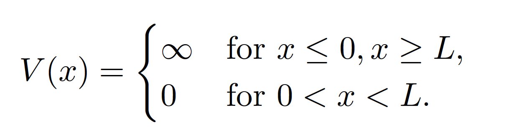
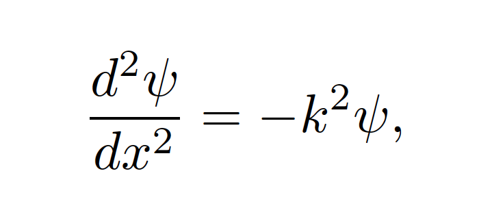
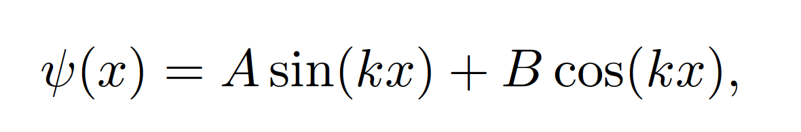
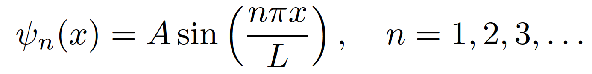

# Abstract
In this recitation, we explore the quantum mechanical system of a particle confined in a one-dimensional
infinite square-well potential. Utilizing the time-independent Schr ̈odinger wave equation, we examine the
wave functions that describe the system’s quantum states and the resulting physical observables. The
infinite square-well potential, ideal for studying quantum confinement, illustrates the quantization of
energy levels and the spatial distribution of a particle within such a potential

# Infinite Square-Well Potential in Quantum Mechanics

The infinite square-well potential is a fundamental model in quantum mechanics, illustrating energy quantization and wave function behavior. This model's potential, \( V(x) \), is defined as zero within the well (\( 0 < x < L \)) and infinite outside it, confining the particle strictly within \( x = 0 \) and \( x = L \).

## Schrödinger Wave Equation

For this system, the Schrödinger wave equation is defined as:

Within the well, the particle is free, and the wave function \( \psi(x) \) satisfies the time-independent Schrödinger equation with \( V = 0 \):

where \( k \) is related to the energy \( E \) by \( k = \sqrt{2mE/\hbar^2} \). The general solution to this equation is a superposition of sine and cosine functions:

To satisfy the boundary conditions (\( \psi(0) = \psi(L) = 0 \)), we find \( B = 0 \) and \( kL = n\pi \), where \( n \) is a positive integer. This leads to the quantized wave functions:

## Analysis

These equations serve as the basis for our analysis of the probability density and energy levels of the particle in the infinite square-well potential.

> **Reference:**  
> Stephen T. Thornton and Andrew Rex. *Modern Physics for Scientists and Engineers*. 4th ed. 2012
> Matthew Civiletti. Modern Physics. *A modern introduction*. 1st ed. 2023

